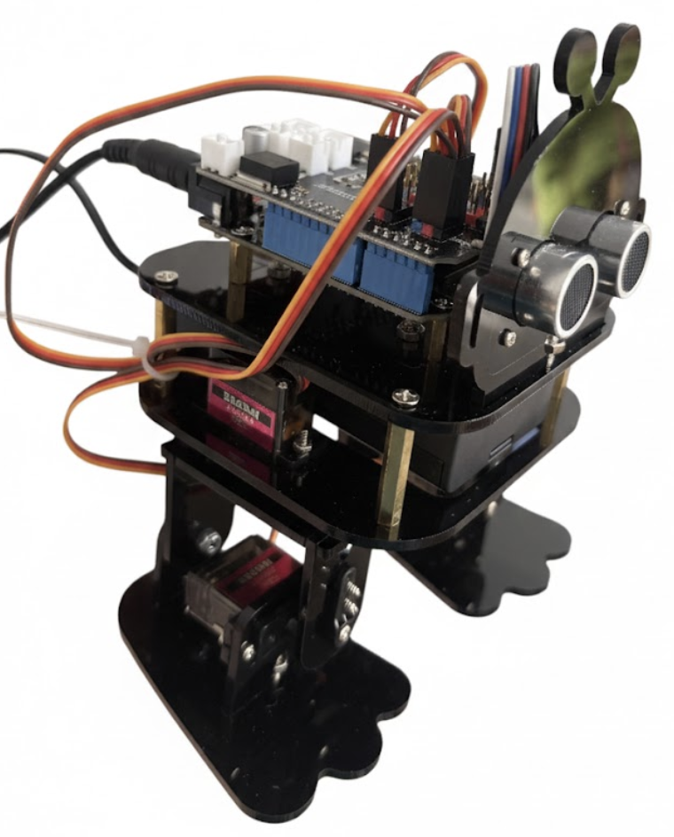

# Acebott Biped Controller

Acebott QD021 Bionic Biped Robot Kit for Arduino ESP32 Electronic Toy Programming
https://acebott.com/product/acebott-qd021-bionic-biped-robot-kit-for-arduino-esp32-electronic-toy-programming/

This project contains the code for controlling a biped robot using MicroPython.

> [!NOTE]
> **Note:** A summary of the fixes applied to this codebase can be found in [FIXES_SUMMARY.md](FIXES_SUMMARY.md).

Original code provided with robot has some pin allocation and motion matrix issues,
causing robot not to move properly and to limp badly.
Fixed files are provided in the [fixed](fixed) directory.



Watch our YouTube playlist of us building and coding the Robot:
https://www.youtube.com/playlist?list=PLJbQUtf-xvhuh_HpCuMb0itskndtWDs_y

## Using mpremote

`mpremote` is a command-line tool that provides utilities to interact with MicroPython devices over a serial connection. It allows you to manage the filesystem, run scripts, and access the REPL.

See [INSTALLATION.md](INSTALLATION.md) for installation instructions.

## AI assistance

Once the installation is complete [Gaunt Sloth](https://gaunt-sloth-assistant.github.io/),
may be used to do deployments to the robot with simple commands like "deploy lesson 5" or "run lesson 1".

When Gaunt Sloth is installed type `gth` in your terminal and chat with your assistant about the robot.

### Connecting to a Device

To list available devices, use:

```bash
mpremote connect list
```

This will show output similar to:

```
/dev/ttyS0 None 0000:0000 None None
...
/dev/ttyUSB0 None 1a86:7523 None USB Serial
```

If the robot is connected to the computer, one of ttyUSB is most likely the robot.

To connect to a specific device, you can use the device path directly:

```bash
mpremote connect /dev/ttyUSB0
```

### Listing Files

Once connected to a device, you can list files on the MicroPython filesystem:

```bash
mpremote connect /dev/ttyUSB0 fs ls
```

This will show output similar to:

```
ls :
         362 acecode.py
         139 boot.py
```

You can also combine commands in a single line:

```bash
mpremote connect /dev/ttyUSB0 fs ls
```

### Other Useful Commands

- **Enter REPL**: `mpremote` (without arguments) or `mpremote connect /dev/ttyUSB0`
- **Run a script**: `mpremote connect /dev/ttyUSB0 run <local_script.py>`
- **Copy file to device**: `mpremote connect /dev/ttyUSB0 fs cp <local_file> :`
- **Copy file from device**: `mpremote connect /dev/ttyUSB0 fs cp :<device_file> .`

For more information about mpremote commands, refer to the [MicroPython documentation](https://docs.micropython.org/en/latest/reference/mpremote.html).

## Deploying Fixed Code

A `fixed` directory has been created containing corrected versions of the robot control code and lessons. These files fix pin wiring discrepancies and movement logic issues.

### 1. Update the Library

First, you must update the robot library on the device.

```bash
# Copy the fixed library to the device's lib folder
mpremote connect /dev/ttyUSB0 fs cp fixed/libs/ACB_Biped_Robot.py :libs/ACB_Biped_Robot.py
```

_Note: Ensure the destination path `:libs/` exists. If not, create it first using `fs mkdir :libs`._

### 2. Run/Deploy Lessons

You can run the fixed lesson files directly from your computer:

```bash
# Run Forward Movement
mpremote connect /dev/ttyUSB0 run fixed/lesson2/Move_Forward.py

# Run Backward Movement (Fixed gait)
mpremote connect /dev/ttyUSB0 run fixed/lesson2/Move_Backward.py
```

Or copy them to the device for autonomous execution:

```bash
mpremote connect /dev/ttyUSB0 fs cp fixed/lesson2/Move_Forward.py :main.py
```

## Deploying the Agent Build

The [for-agents](for-agents) directory contains a web server intended to be driven by an AI agent rather than a human in a browser. Endpoints are named after the action they perform (so an LLM can't confuse a magic number for the wrong command), and movement endpoints accept an optional `?steps=N` parameter.

> **Not compatible with the lesson7 `/control?var=robot&val=N` protocol.** This is a clean break — no `/control` route exists.

### Endpoints

All endpoints are `GET`. Each call blocks until the action finishes, then returns a small JSON or plain-text body.

**Movement** (`?steps=N`, default `1`, capped at `10`):

| endpoint      | what it does          |
| ------------- | --------------------- |
| `/forward`    | walk forward          |
| `/backward`   | walk backward         |
| `/turn_left`  | rotate left in place  |
| `/turn_right` | rotate right in place |
| `/stop`       | freeze servos         |

Approximate calibration on a flat smooth surface: 1 forward/backward cycle ≈ 1.5 cm of travel; 8 turn cycles ≈ 90° of rotation.

**Sensing:**

| endpoint    | returns                                                                                              |
| ----------- | ---------------------------------------------------------------------------------------------------- |
| `/distance` | ultrasonic reading in cm (plain text; `-1.0` on failure)                                             |
| `/status`   | JSON `{uptimeMs, lastCommand, lastSteps, lastCommandAtMs, lastDistanceCm}`                           |

**Trick moves** (single cycle, no `steps` parameter):

| endpoint        | endpoint         |
| --------------- | ---------------- |
| `/sprint`       | `/dance`         |
| `/avoid`        | `/follow`        |
| `/kick_left`    | `/kick_right`    |
| `/tilt_left`    | `/tilt_right`    |
| `/stamp_left`   | `/stamp_right`   |
| `/ankles_left`  | `/ankles_right`  |

Make sure the fixed library is already on the device (see [Update the Library](#1-update-the-library)).

### Optional: also join your WiFi

By default the robot only exposes its own access point (`Biped_Robot` / `12345678`), so the dev machine has to disconnect from the internet to talk to it. The agent build can additionally join your existing WiFi (home, classroom, club) as a station — the AP stays up as a fallback, and you get a second IP on your LAN.

To enable, copy the example credentials file, fill in your SSID and password, and copy it to the device:

```bash
cp for-agents/wifi_config.example.py for-agents/wifi_config.py
# edit for-agents/wifi_config.py with your SSID and password
mpremote connect /dev/ttyUSB0 fs cp for-agents/wifi_config.py :wifi_config.py
```

`for-agents/wifi_config.py` is gitignored. If the file is absent on the device, the robot runs in AP-only mode (same as before). The boot log prints both IPs (or just the AP IP if STA fails or no config exists).

### Run the program

Run the agent program directly:

```bash
mpremote connect /dev/ttyUSB0 run for-agents/Biped_Robot_Web.py
```

Or copy it as `main.py` so the robot starts the agent server on every power-on:

```bash
mpremote connect /dev/ttyUSB0 fs cp for-agents/Biped_Robot_Web.py :main.py
```

Once running, the robot exposes its access point `Biped_Robot` (password `12345678`). Connect to that network and the device's HTTP server is reachable at `http://192.168.4.1/` — visiting the root prints a one-page summary of the available endpoints. Quick smoke test:

```bash
curl 'http://192.168.4.1/distance'
# -> e.g. "23.4"

curl 'http://192.168.4.1/status'
# -> {"uptimeMs": 12345, "lastCommand": "forward", "lastSteps": 2, ...}

curl 'http://192.168.4.1/forward?steps=2'
# -> {"action": "forward", "steps": 2}
```
