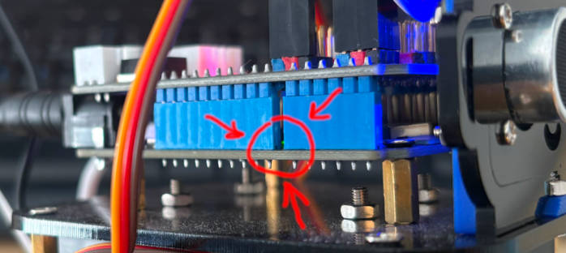

# Testing

## Confirming that ESP32 was flashed successfully with Micropython

```bash
mpremote connect /dev/ttyUSB0 run tests/01-led.py
```

Note Pin2 LED is really hard to see, it is on the main board under the carshield board, the only way to see it is to peek between connectors.

